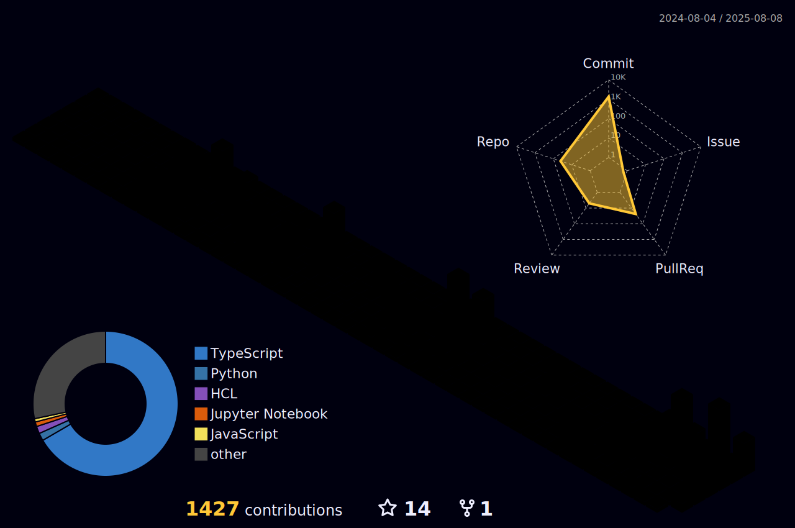

# Lee Dongwook

## 👋 안녕하세요! 프론트엔드 개발자 이동욱입니다.

### 문제를 발견하고 기술적으로 해결하는 과정을 꾸준히 지속하고자 합니다.
프로젝트를 수행하며 발생한 문제들을 해결하고, 더 나은 사용자 경험 제공과 성능 향상을 목표로 새로운 기술을 적용해보며 학습을 꾸준히 합니다.   

동료 피드백을 수용하여 부족한 부분을 지속적으로 개선하고자 노력합니다.

### 지식과 경험을 공유하고 함께 성장하고자 노력합니다.
기술 블로그를 운영하고 있습니다.

## Work Experience
|   회사명    |    직급     |  기간  | 
|--------|---------|---------|
| **(주) FutureWorkLab** | 사원 | 2024.10 - |
| **(주) EXEM** | 인턴 | 2023.07 - 2023.12 |

## Tech Stack
 |
       
       |
    |
   

## Activities

| 활동                                      | 기간                    |
|-------------------------------------------|-------------------------|
| **홍익대학교 컴퓨터공학전공 학술동아리 _P.C.R.C_ 32기** | 2018.03 - 2019.12   |
| **고려대학교 창업 준비 동아리 _Novelia_ FE 개발** | 2023.01 - 2023.05        |
| **홍익대학교 학습튜터링2 (홍익투게더) 멘토 _이끄미_ 활동** | 2023.03 - 2023.07   |

## Education 

|                                      | 기간                    |
|-------------------------------------------|-------------------------|
| **홍익대학교 정보컴퓨터공학부 컴퓨터공학전공**    | 2018.03 - 2024.08 |
| **인프런 X 코드캠프 고농축 프론트엔드 온라인 코스** |  2023.07 - 2024.01 |
| **원티드 프리온보딩 프론트엔드 3월 챌린지**     | 2024.03           |

